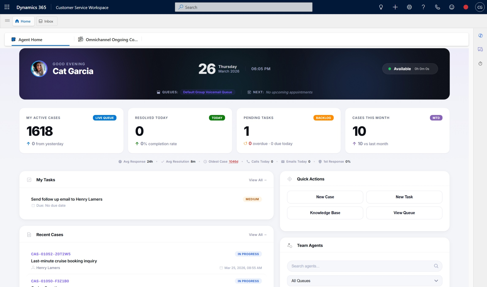

# D365 Contact Center  Agent Home

A modern, high-performance homepage for Dynamics 365 Contact Center agents. Built as a single HTML web resource with the **Horizon** design system  Inter font, violet accent (`#7c5cfc`), semantic color tokens, frosted-glass effects, and responsive layout.

## Highlights

- **Mission Control Header**  personalized greeting, animated orbs, live date/time, presence status with duration tracker
- **Header Stats Bar**  user queue pills (expandable with +N more) and next calendar appointment
- **4 Metric Cards**  Active Cases, Resolved Today, Pending Tasks, CSAT / Monthly volume (click to drill down)
- **Info Strip**  6 secondary stats displayed inline with dot separators: Avg Response, Avg Resolution, Oldest Case (clickable  navigates to case), Calls Today, Emails Today, 1st Response %
- **My Tasks**  upcoming tasks with priority badges, due dates, and overdue indicators
- **Recent Cases**  latest cases with status, customer name, and age
- **Quick Actions**  one-click New Case, New Task, Knowledge Base, View Queue
- **Team Agents**  real-time presence with queue filtering, search, online/offline tabs, and time-in-status tracking
- **Responsive**  works on desktop and tablet

## Web Resource Details

| Property | Value |
|----------|-------|
| **Logical Name** | `maulabs_agent_home` |
| **Type** | HTML (1) |
| **File** | `Agent Home.html` |

## Installation

1. Import the managed/unmanaged solution ZIP into your D365 environment, **or**
2. Create an HTML web resource named `maulabs_agent_home` and paste the contents of `Agent Home.html`
3. Add the web resource to your Contact Center app sitemap or agent dashboard

## Design System  Horizon

| Token | Value |
|-------|-------|
| Font | Inter (Google Fonts) |
| Accent | `#7c5cfc` (violet) |
| Card radius | `20px` |
| Shadows | 3-tier elevation system |
| Surfaces | Frosted glass with `backdrop-filter` |

## Data Sources

All data is fetched live from Dataverse via `Xrm.WebApi`:

- **Cases**  `incident` (active, resolved, oldest open)
- **Tasks**  `task` (open, owned by current user)
- **Queues**  `queue` + `queuemembership`
- **Phone Calls**  `phonecall` (today)
- **Emails**  `email` (today)
- **Calendar**  `activitypointer` (next appointment)
- **Team Presence**  `systemuser` + Omnichannel presence

## License

See [LICENSE](LICENSE) for details.

## Icon

The included example icon is from [Iconoir](https://iconoir.com/), a free open-source icon library. Use any icon that fits your branding.
