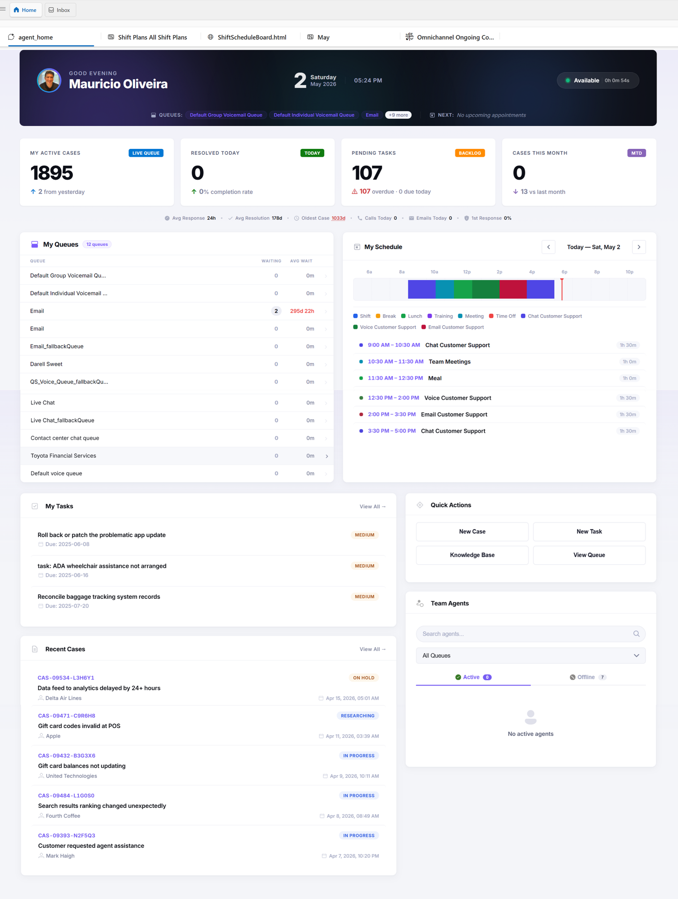

# Agent Home — D365 Custom Web Resource



A unified agent dashboard for Dynamics 365 Customer Service, providing real-time presence, queue management, performance metrics, and schedule visualization in a single web resource.

---

## Features

### My Presence
- Set and display your current presence status (Available, Busy, Do Not Disturb, Away, Offline)
- Polling interval: 10 seconds (throttle-safe)

### My Queues
- View all queues you are assigned to
- See live agent counts and queue item counts per queue

### Online Agents
- See which agents are currently online across your queues
- Shows presence indicator and queue membership per agent

### My Metrics
- CSAT trend, handle time, first-contact resolution, and other KPIs
- Filtered to your activities (no cross-agent data leakage)

### My Schedule (WFM)
- Visual timeline of your Workforce Management schedule for the current day
- Horizontal bar chart spanning your configured working hours
- **Square-corner bars** — no rounded edges
- **No text labels on bars** — clean, uncluttered view
- **Color legend** always visible below the timeline

#### Standard Schedule Type Colors

| Type     | Color   | Hex       |
|----------|---------|-----------|
| Shift    | Blue    | `#2563eb` |
| Break    | Amber   | `#f59e0b` |
| Lunch    | Green   | `#16a34a` |
| Training | Purple  | `#7c3aed` |
| Meeting  | Teal    | `#0891b2` |
| Time Off | Red     | `#ef4444` |

#### Custom / Unknown Schedule Types
If your organization uses custom WFM activity types not in the standard list above, the dashboard will:
- **Automatically detect** any schedule type not matching a known keyword
- **Assign a unique color** from a 12-color palette using a deterministic hash of the type name — the same custom type always gets the same color, across page reloads and re-renders
- **Append a legend entry** dynamically below the standard types, showing the actual type name and its assigned color
- Support **unlimited custom types** — the hash-based system scales with however many types your org creates

Custom type palette (12 colors, cycled by hash): pink, orange, sky-blue, indigo, fuchsia, rose, amber-dark, dark-green, dark-cyan, deep-violet, brown, royal-blue.

---

## Requirements

- Dynamics 365 Customer Service (with Omnichannel or equivalent)
- WFM / scheduling configured (for My Schedule section)
- Web resource added to a D365 model-driven app page

---

## Deployment

1. Download the latest release ZIP from the [Releases](https://github.com/moliveirapinto/D365-Agent-Home/releases) page
2. Import to D365 via **Settings → Solutions → Import**
3. Publish all customizations
4. Add the `maulabs_agent_home` web resource to your model-driven app

Or use the Power Platform CLI:
```bash
pac solution import --path AgentHome_<version>.zip --publish-changes --force-overwrite
```

---

## Version History

| Version  | Date       | Key Changes |
|----------|------------|-------------|
| v2.2.0.0 | 2025-04    | Initial fixes: `window.top` removal, `console.log` removal, `'use strict'`, XSS fixes, presence poll 10 s |
| v2.3.0.0 | 2025-04    | ZIP packaging fix: forward-slash paths in archive (D365 web resource overwrite reliability) |
| v2.4.0.0 | 2025-04    | `queuemembership` filter fix: `systemuserid eq` (intersect entity) instead of `_systemuserid_value eq`; WFM schedule filter fix |
| v2.5.0.0 | 2025-04    | Schedule UI overhaul: square-corner bars, solid colors (no gradients), no text on bars, full 7-type static color legend |
| v2.6.0.0 | 2025-05    | Dynamic color system: custom/unknown schedule types auto-assigned unique colors via deterministic hash; dynamic legend shows all types including custom; `type-default` gray fallback eliminated |
| v2.7.0.0 | 2025-05    | UI: My Queues section gets white card background with border, shadow, and aligned padding |

---

## Publisher

**Maulabs** — prefix `maulabs`
